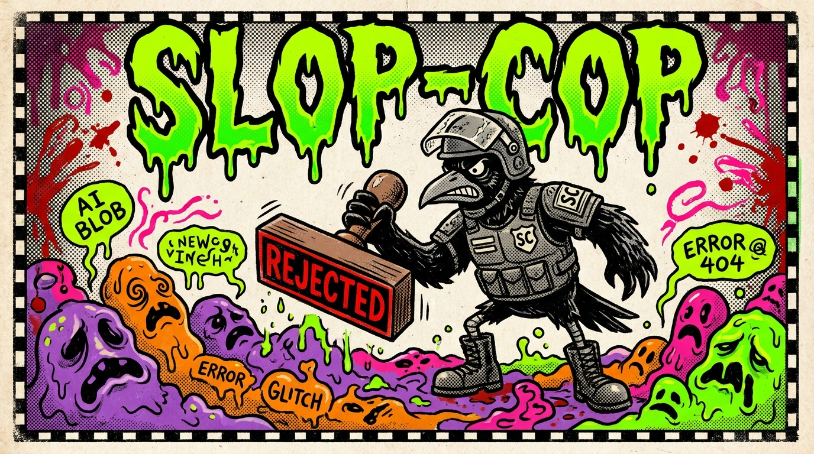

<p align="center">
  
</p>

<h1 align="center">slop-cop</h1>

<p align="center">
  <b>The visual QA skill that catches AI slop before it ships.</b><br>
  Vets your A/B asset variants. Kills gibberish text on graphics. Flags broken UIs.<br>
  One job: don't let the slop reach prod.
</p>

<p align="center">
  <a href="https://clawhub.ai/skills/chchchadzilla/slop-cop"></a>
  <a href="https://github.com/chchchadzilla/slop-cop/blob/main/SKILL.md"></a>
</p>

---

## What this does

You generate an image (logo, banner, illustration) with an AI tool. It looks "mostly right" at a glance. You ship it.

Then a week later you notice the text says **"EDIT AGGREE"** instead of "EDIT AGREE." Or the logo has a fourth letter that's actually two letters smushed together. Or the hand has six fingers.

**slop-cop catches that BEFORE you ship.** It loads a vision model, runs the image against a hard-kill checklist (gibberish text on shipped graphics = automatic reject, no matter what the vision model says), and gives you one of three verdicts:

- 🚔 **KILL** — Do not ship. Here's exactly what's broken.
- 🔧 **FIX** — Ship-able after one specific edit (alpha cut, copy fix, etc).
- ✅ **SHIP** — Send it.

It also vets **A/B variants** against each other, audits UI/UX changes against a checklist, and rejects branding violations.

---

## Install (for non-technical folks)

> If you don't have OpenClaw yet, get it first: [https://docs.openclaw.ai/start/getting-started](https://docs.openclaw.ai/start/getting-started)

### Step 1 — Open your terminal

- **Mac:** Press `Cmd + Space`, type "Terminal," hit Enter.
- **Windows:** Press the Windows key, type "PowerShell," hit Enter.
- **Linux:** You know how to open a terminal.

### Step 2 — Install the skill

Copy and paste this exact line into the terminal and press Enter:

```bash
openclaw skills install slop-cop
```

You should see something like `✓ Installed slop-cop`.

### Step 3 — Verify it loaded

```bash
openclaw skills list
```

You should see `slop-cop` in the list. Done.

### Step 4 — Use it

Start a new OpenClaw session (close any open one and run `openclaw` again). The skill is now available to your AI agent. Just ask it things like:

- *"Use slop-cop to check this logo: `./my-logo.png`"*
- *"slop-cop these two banner variants and pick the winner: `a.png` and `b.png`"*
- *"Run slop-cop on the new homepage screenshot, focusing on the hero text"*

The AI will load the skill automatically and run the checks.

---

## What it catches (real examples)

| Problem | slop-cop verdict |
|---|---|
| Image text says "EDIT AGGREE" instead of "EDIT AGREE" | 🚔 KILL |
| Logo has a phantom extra letter mashed in | 🚔 KILL |
| Hand has 6 fingers | 🚔 KILL |
| Background needs to be transparent but isn't | 🔧 FIX (alpha cut) |
| Tagline conflicts with site's actual tagline | 🔧 FIX (copy update) |
| Clean, on-brand, no defects | ✅ SHIP |

---

## How it differs from "just asking a vision model"

Vision models are too lenient. Ask GPT or Gemini "is this image good?" and they'll say yes 80% of the time even when there's gibberish on the page. slop-cop has **hard-kill rules** that override the vision model's softer verdicts. If garbled text is on a shipped graphic, it's a KILL no matter how pretty the rest looks. The skill is the bouncer; the vision model is the bartender. Bouncer wins.

---

## Files in this repo

| File | What it is |
|---|---|
| `SKILL.md` | The skill definition + main workflow |
| `references/vision-prompt-template.md` | The exact prompt sent to the vision model |
| `references/checklist.md` | Hard-kill criteria |
| `references/anti-patterns.md` | Common AI-image failure modes |
| `references/promo-copy.md` | Marketing copy for clawhub listing |
| `assets/banner.jpg` | This README's banner |

---

## Links

- 🌐 **ClawHub:** [https://clawhub.ai/skills/chchchadzilla/slop-cop](https://clawhub.ai/skills/chchchadzilla/slop-cop)
- 🐙 **GitHub:** [https://github.com/chchchadzilla/slop-cop](https://github.com/chchchadzilla/slop-cop)
- 📜 **License:** MIT

---

<p align="center">
  <i>Built by <a href="https://github.com/chchchadzilla">@chchchadzilla</a> with crow-energy assist from José 🐦‍⬛</i>
</p>
